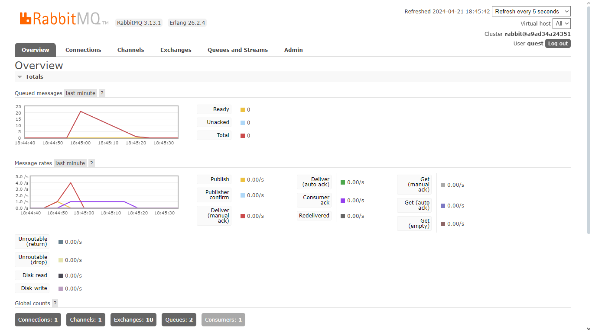

# Reflection 1
a. what is amqp?
> AMQP (Advanced Message Queuing Protocol) is a messaging protocol that enables client applications to communicate with a message broker that implements the protocol. It is designed to be a reliable, efficient, and flexible protocol for messaging.
b. what it means? guest:guest@localhost:5672 , what is the first quest, and what is
the second guest, and what is localhost:5672 is for?
> guest:guest is the username and password for the RabbitMQ server. localhost:5672 is the address of the RabbitMQ server. The default port for RabbitMQ is 5672.

> The number of queue as seen above is due to the amuont of messages sent by the publisher to the message broker has yet to be all processed by the consumer as the consumer is slower than the publisher. Therefore all of the unprocessed messages are stored in the queue.

> The queue is consumed at a significantly faster rate because there are 3 consumers consuming the messages from the queue. Therefore the number of messages in the queue is reduced significantly. The message broker is able to balance the load between the consumers and distribute the messages to the consumers.